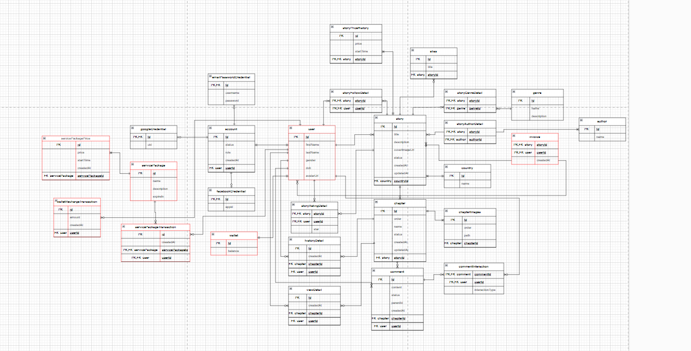

# MICROSERVICE_NODEJS_NGINX CHO TRANG WEB ĐỌC TRUYỆN
## Mục đích và yêu cầu dự án:
- Dự án được thực hiện để hoàn thành môn học Lập Trình Hướng Dịch Vụ tại PTITHCM. 
- Với mức độ yêu cầu cơ bản :
  - Viết SOA (restfull api) cho dự án.
  - Tiến hành viết SOA-Microservice , triển khai trên docker và k8s.

- Mình dùng nodejs(Expressjs) để triển khai các server liên kết với nhau. Apigateway mình sử dụng chính cho dự án lần này là nginx (mọi người có thể tham khảo kong - docker).
- Database chủ yếu sử dụng mysql cho các server.
- Dùng prisma để pull , migrate và generate các table về các database 1 cách thuận tiện.
- Sử dụng cơ bản RabbitMQ (docker của RabbitMq).

## Lý thuyết cơ bản:
### SOA (Service-Oriented Architecture)
- Kiến trúc hướng dịch vụ (SOA) là một phương pháp phát triển phần mềm sử dụng các thành phần của phần mềm được gọi là dịch vụ để tạo ra các ứng dụng dành cho doanh nghiệp. Mỗi dịch vụ cung cấp một tính năng doanh nghiệp, đồng thời các dịch vụ cũng có thể giao tiếp với nhau giữa nhiều nền tảng và ngôn ngữ.[Thông tin thêm.](https://aws.amazon.com/vi/what-is/service-oriented-architecture/#:~:text=Ki%E1%BA%BFn%20tr%C3%BAc%20h%C6%B0%E1%BB%9Bng%20d%E1%BB%8Bch%20v%E1%BB%A5%20(SOA)%20l%C3%A0%20m%E1%BB%99t%20ph%C6%B0%C6%A1ng%20ph%C3%A1p,n%E1%BB%81n%20t%E1%BA%A3ng%20v%C3%A0%20ng%C3%B4n%20ng%E1%BB%AF.)
  

### Microservices 
- Microservice là một kỹ thuật phát triển phần mềm, một biến thể của kiến trúc hướng dịch vụ (SOA) cấu trúc một ứng dụng như một tập hợp các dịch vụ được ghép lỏng lẻo. Trong kiến trúc microservice, các dịch vụ được xử lý tốt và các giao thức rất nhẹ.[Thêm thông tin chi tiết tại đây](https://vi.wikipedia.org/wiki/Microservices#:~:text=Microservice%20l%C3%A0%20m%E1%BB%99t%20k%E1%BB%B9%20thu%E1%BA%ADt,c%C3%A1c%20giao%20th%E1%BB%A9c%20r%E1%BA%A5t%20nh%E1%BA%B9.).

    

### DOCKER
- Docker là hệ điều hành dành cho container. Cũng tương tự như cách máy ảo ảo hóa (loại bỏ nhu cầu quản lý trực tiếp) phần cứng máy chủ, các container sẽ ảo hóa hệ điều hành của máy chủ. Docker được cài đặt trên từng máy chủ và cung cấp các lệnh đơn giản mà bạn có thể sử dụng để dựng, khởi động hoặc dừng container.[Thông tin chi tiết.](https://aws.amazon.com/vi/docker/#:~:text=Docker%20l%C3%A0%20h%E1%BB%87%20%C4%91i%E1%BB%81u%20h%C3%A0nh,kh%E1%BB%9Fi%20%C4%91%E1%BB%99ng%20ho%E1%BA%B7c%20d%E1%BB%ABng%20container.)

    

### RABBITMQ
- RabbitMQ là một phần mềm trung gian (middleware) mã nguồn mở được sử dụng để triển khai giao tiếp giữa các ứng dụng và dịch vụ trong một hệ thống phần mềm. Nó thường được sử dụng để xây dựng các hệ thống phân tán và có thể xử lý một lượng lớn các tin nhắn từ các ứng dụng và dịch vụ khác nhau.
- RabbitMQ thực hiện giao tiếp thông qua mô hình message broker, nơi các ứng dụng gửi và nhận các tin nhắn qua một hàng đợi (queue). Điều này giúp tạo ra một môi trường linh hoạt và không chặt chẽ, nơi các ứng dụng có thể gửi các yêu cầu và thông báo mà không cần biết về nhau.[Thông tin chi tiết](https://viblo.asia/p/rabbitmq-la-gi-bJzKmD0w59N)
    

## TRIỂN KHAI CÁC DỰ ÁN
### CƠ SỞ DỮ LIỆU CHO TRANG WEB TRUYỆN
- 
  [Thông tin chi tiết](https://app.diagrams.net/#G1ibSEI4R44HCYGfi7AH5xrzGWrLZobv31#%7B%22pageId%22%3A%22Jrzk5w00DyGr-R9YersY%22%7D)

- Dự án sẽ chia làm 3 server chính đó là auth server, payment server, và phần còn lại là phần story server (bao gồm các phần về truyện , thể loại , nội dụng ,tác giả ,...).

## MÌNH SẼ GIẢI THÍCH TỪNG PHẦN SERVER VÀ NGINX VÀO CÁC FILE README.md Ở DƯỚI.

- [Triển khai nginx với docker thể nào!]()
- [Triển khai server auth với docker như thế nào!]()
- [Triển khai server payment với docker như thế nào!]()
- [Triển khai rabbitMQ với docker như thế nào!]()